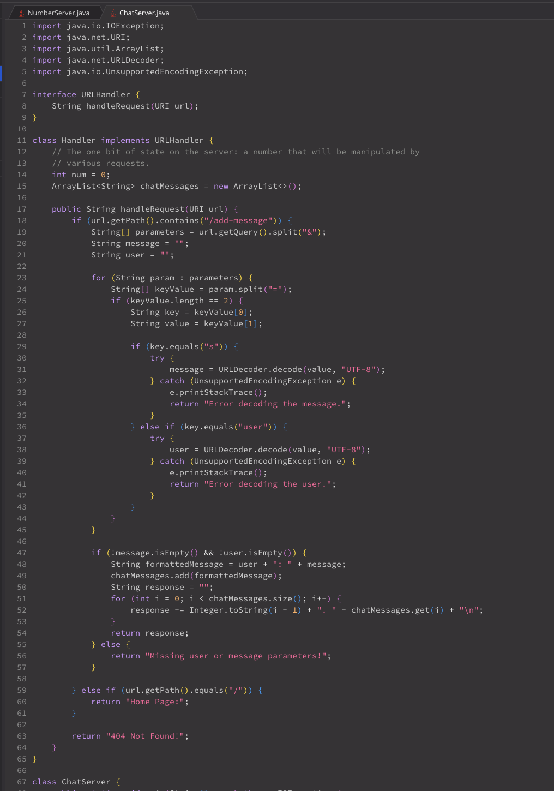
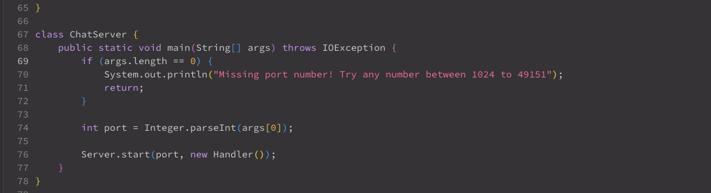
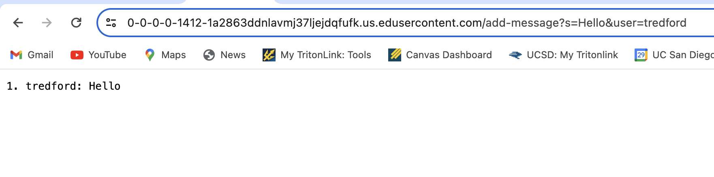
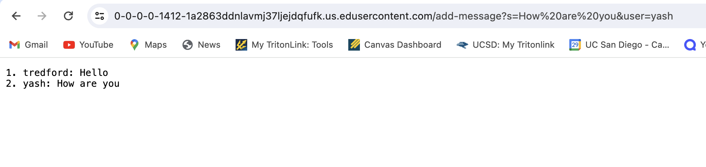
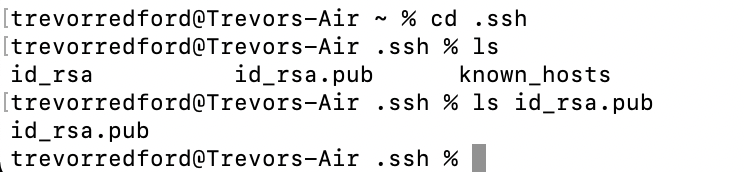
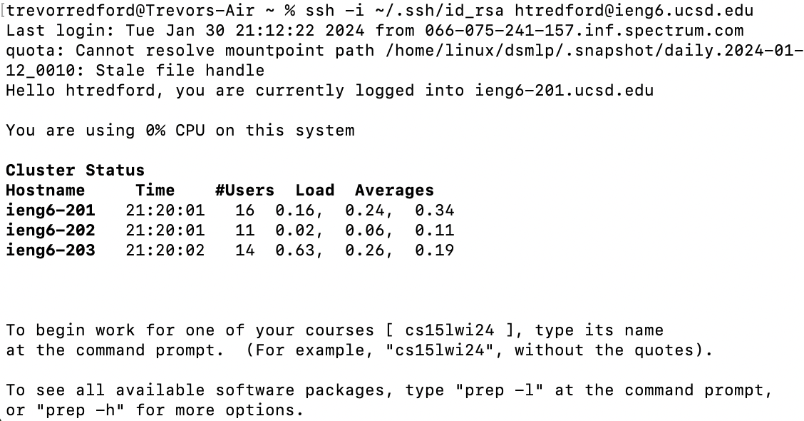
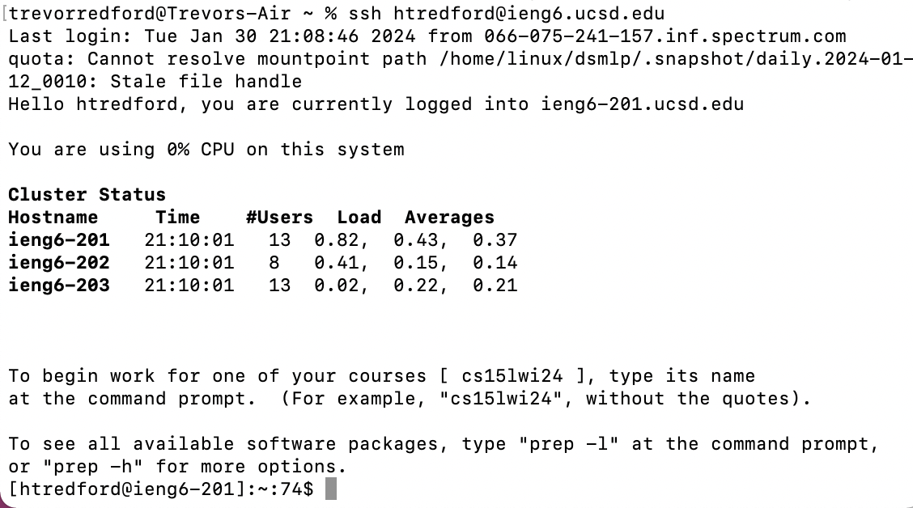

# CSE15L Lab Report 2
## Hugh(Trevor) Redford
## A17067426

## Part 1:
Here is the code I wrote for the ChatServer file

Here are the screenshots of the ChatServer working:

In this screenshot of the ChatServer at work, the method that is called first is in the NumberSevrer class which is the main method. Furthermore, the start method in the Server class is called and creates the server. The handleRequest is called with the URL as the argument. When the /add-message?s=Hello&user=tredford is added to the end of the URL, "tredford: Hello" is printed on screen numbered 1. The path and the query of the URL are the arguments that are important. The field  ArrayList<String> chatMessages is manipulated due to the message Hello and the user being added to the list. However, no specific values are changed becasue of the code, especially the field ArrayList<String> chatMessages and the main method NumberServer. 

As demonstrated in the previous screenshot, the method that is called is handleRequest. It takes the URL as the argument. Once again the important arguments are the path and the query. The query is the same, but this time adds the String "How are you" and the user is "yash", This is done to the field  ArrayList<String> chatMessages, which changes it. This results in the noted change to the server. "yash: How are you" is printed on screen numbered 2. Other requests that lack the /add-message command leads to the server printing out a 404 Not Found! This happens because I did not code for other requests that lack the /add-message command.

## Part 2:

In this screenshot, utilizing ls, the path of my priavte ssh key would be C:/Users/trevorredford/.ssh/id_rsa.pub

In this screenshot, I use ieng6 and used ssh key. The path to my public key on ieng6 would be ~/.ssh/id_rsa

In this screenshot, i was able to login to ieng6 without providing my password.

## Part 3:
During weeks two and three I learned a lot of valuable information. The most important information was how to login to a remote server and create a personalized key that can let me login without providing my password. 
