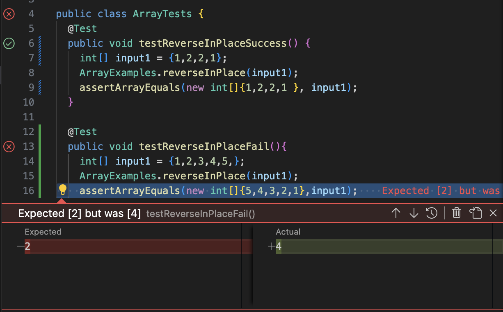

# CSE 15L Lab Report 3:
## Hugh Trevor Redford
## A17067426

## Part1
The bug I'm choosing takes in an array, and reverses it, which is from the reverseInPlace method.

```
public void testReverseInPlace() {
  int[] input1 = {1,2,3,4,5};
  ArrayExamples.reverseInPlace(input1);
  assertArrayEquals(new int[]{5,4,3,2,1}, input1);
}
```
This test is intended to assess the method's functionality with a straightforward input to confirm its basic operation. However, the current outcome indicates a failure, as the observed output is ```{5, 4, 3, 4, 5}```.
```
public void testReverseInPlace() {
  int[] input1 = {1,2,2,1};
  ArrayExamples.reverseInPlace(input1);
  assertArrayEquals(new int[]{1,2,2,1}, input1);
}
```
This test does not result in a failure due to the symmetric nature of the array. When iterating through the second half of the array, if the method unintentionally mirrors the first half, it effectively reproduces the original array.


The screenshot illustrates both unsuccessful and successful inputs. The issue is due to the method producing 4 instead of the anticipated 2.

## Code Before
```
static void reverseInPlace(int[] arr) {
  for(int i = 0; i < arr.length; i += 1) {
  arr[i] = arr[arr.length - i - 1];
  }
}
```
## Code After
```
static void reverseInPlace(int[] arr) {
  for(int i = 0; i < arr.length / 2; i += 1) {
    int temp = arr[i];
    arr[i] = arr[arr.length - i - 1];
    arr[arr.length - i - 1] = temp;
  }
}
```
This code begins by initializing a temporary integer using the variable `i` within the loop. It then proceeds to swap the element on the opposite side, followed by swapping the temporary element with its corresponding element. Notably, the iteration covers only half of the list, ensuring that the resulting output doesn't merely resemble a mirrored list.

## Part 2:
## Find Command
The find command is an extremely useful way to find specific files or directories. The ```type``` option enables the identification of items based on their characteristics, such as directories (designated by 'd'), files ('f'), and so on.

Executing the command ```find ./technical -type d``` generates a list of directories within the ```./technical``` directory.
The resulting output is:
```
./technical
./technical/government
./technical/government/About_LSC
./technical/government/Env_Prot_Agen
./technical/government/Alcohol_Problems
./technical/government/Gen_Account_Office
./technical/government/Post_Rate_Comm
./technical/government/Media
./technical/plos
./technical/empty
./technical/biomed
./technical/911report
```
