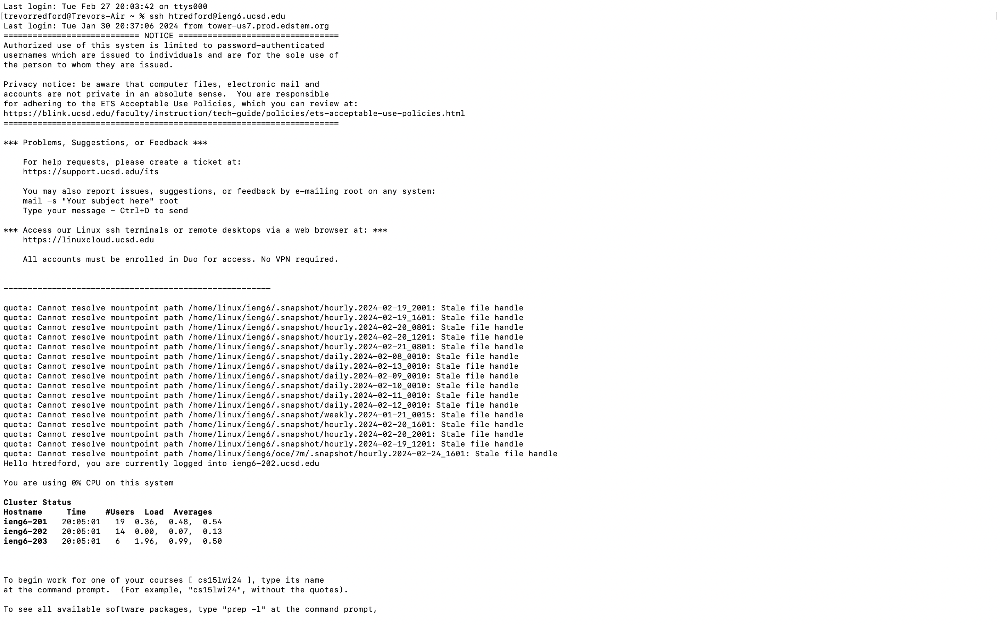
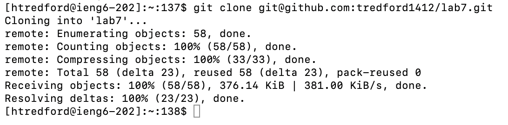
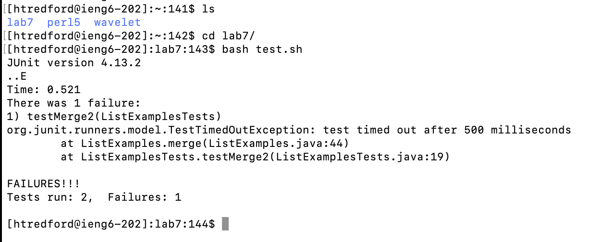
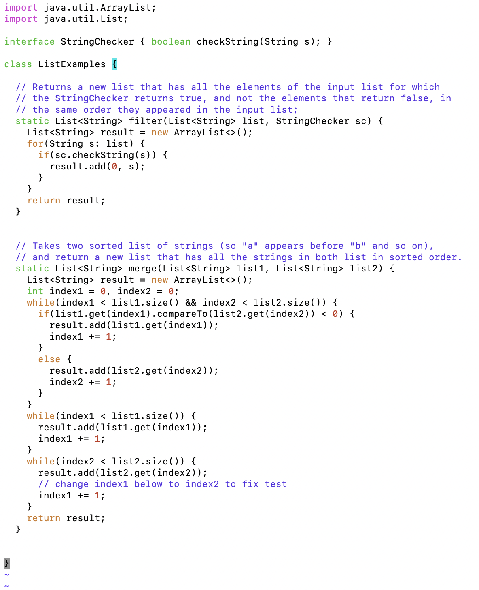
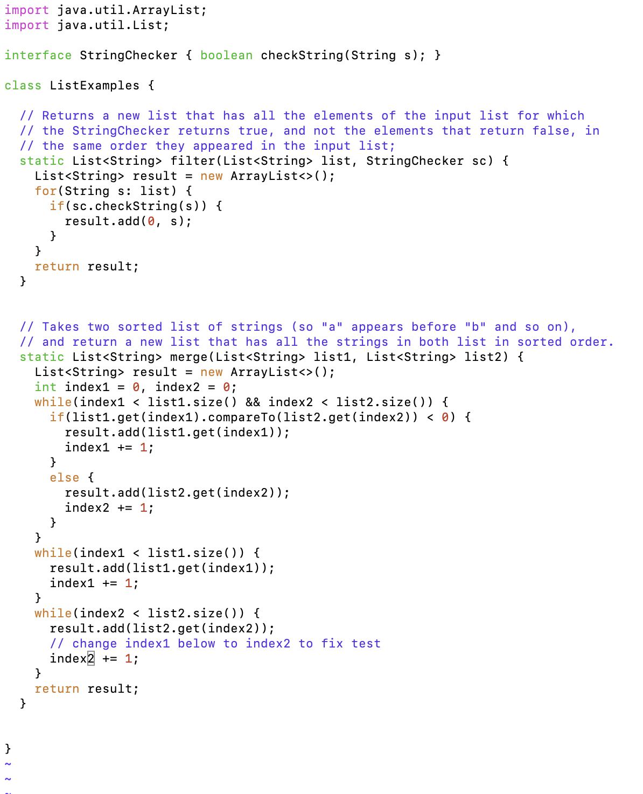
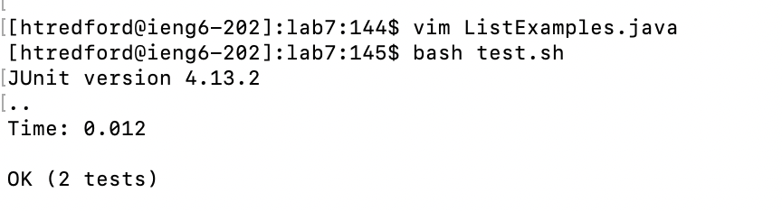

# CSE 15L Lab Report 3:
## Hugh Trevor Redford
## A17067426

**Step 1: Log into ieng6.**

In this step, I initiated the login process by entering `ssh htredford@ieng6.ucsd.edu` and pressing `<enter>`.

In summary: This effectively logged me into my ieng6 account without the need for a password, as my SSH key seamlessly bypassed the login authentication.

___

**Step 2: Git Clone into ieng6.**

In this step, I initiated the cloning process with the `git clone` command. To streamline the procedure, I utilized `<cmd C>` and `<cmd V>` to copy and paste the SSH URL from my lab7 fork directly into the command line. Finally, I pressed `<enter>` to execute the command.

In summary, I employed these commands to efficiently clone the repository into ieng6. This allows me to review files, execute tests, and debug within the ieng6 environment. The use of `<cmd C>` and `<cmd V>` considerably simplified the process, eliminating the need to manually type out the entire SSH URL from GitHub.

___

**Step 3: Running the test, demonstrating failure.**

In this step, I employed the `ls` command to inspect the contents of ieng6. Subsequently, I navigated to the 'lab7' directory by using `cd l` followed by `<tab>` for auto-completion, then pressed `<enter>` to execute the command. Afterward, I utilized `ls` once more and executed the JUnit tests with the command `bash t` + `<tab>` for auto-completion, followed by pressing `<enter>`.

In summary: These commands facilitated the execution of JUnit tests, demonstrating a test failure. I optimized the testing process by incorporating shortcuts like `<tab>` to reduce keystrokes and enhance efficiency.

___

**Step 4: Edit the code file to fix the failing test**

In this step, I addressed the error in the file 'ListExamples.java' by utilizing the command `vim ListExamples.java`, manually inputting it due to a naming conflict with another file. After typing the command, I pressed `<enter>` to execute and access Vim. Once in Vim, I entered insert mode with `<i>`. Proceeding, I navigated down 43 lines and right 12 times to pinpoint the section of code requiring modification. While in insert mode, I used `<backspace>` to eliminate the '1' in `index1` and replaced it with '2' by pressing `<2>`. Exiting insert mode with `<esc>`, I employed the command `:wq` to save and exit the file.

In summary: I employed fundamental Vim commands to navigate and rectify the bug in the 'ListExamples.java' file. While other commands could offer more efficient navigation, my chosen approach was simple and direct.

To Enter Vim

Before Editing The Bug In Vim

After Editing The Bug In Vim

___

**Step 5: Run the tests, displaying they now run**

In this step, I exited Vim, and then I streamlined the process by pressing `<up>` twice to retrieve the previously executed `bash test.sh` command. Confirming my selection, I pressed `<enter>` to rerun the tests, and this time they passed.

In summary: This step closely mirrored step 3, with the notable enhancement of efficiency through the use of `<up>` arrows to quickly recover and rerun the previous bash command.

